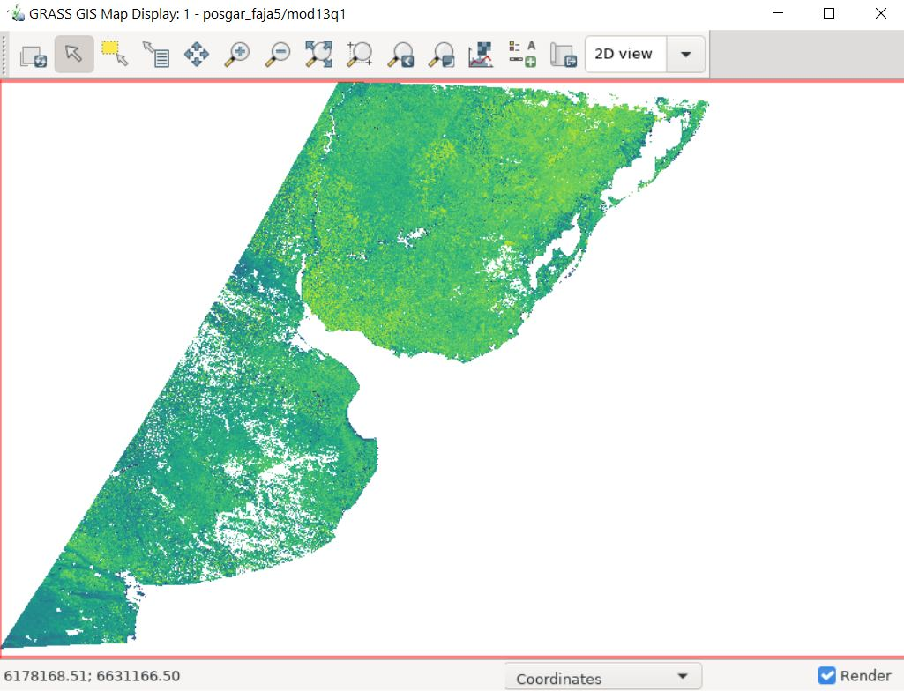
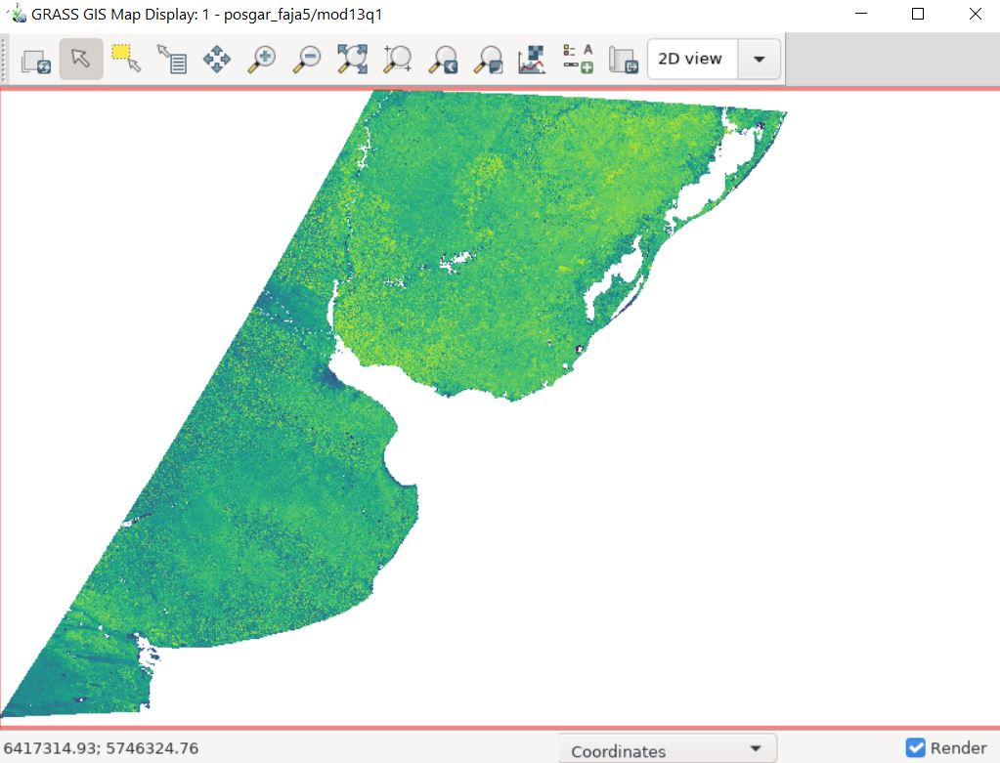
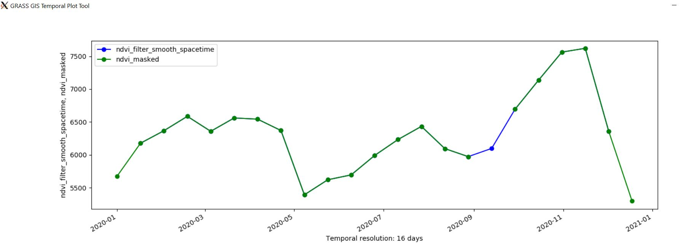

# Space and/or time filters applied to MODIS NDVI and EVI products 
GrassGIS Workshop 2021 - Taller Grass 2021

The objectives of this workflow are:

* Download [MODIS](https://lpdaac.usgs.gov/products/mod13q1v006/) products, import and re-project them to work with Grass.
* Use MODIS' Quality Assessment band to control time series pixels quality.
* Mask low quality pixels.
* Generate time series where pixels with problems are replaced with data interpolated spatially and/or temporally. 

## Requirements to perform this tutorial
* Install [i.modis](https://grass.osgeo.org/grass78/manuals/addons/i.modis.html) lastest version.
* Create a mapset with the selected SRC (posgar_faja5, EPSG:5347).


These instructions are written and had been tested to run on Windows 10 and Ubuntu xx).

Full script can be downloaded from [here](TP_Grass_MOD13Q3.sh).

### 1. Create a new Mapset under Location posgar_faja5
```
g.mapset -c mapset=mod13q1
```
### 2. Download MODIS data
```
i.modis.download settings=$HOME/gisdata/NASA_SETTING.txt \
  product=ndvi_terra_sixteen_250 \
  tile=h13v12 \
  startday=2020-01-01 endday=2020-12-31 \
  folder=/tmp
```
### 3. Import NDVI , EVI and VI Quality bands
```
i.modis.import files=/tmp/listfileMOD13Q1.006.txt \
  spectral="( 1 1 1 0 0 0 0 0 0 0 0 0 )"
```
### 4. Set region to map extension and resolution
```
g.region -p raster=MOD13Q1.A2020001.h13v12.single_250m_16_days_NDVI
```
### 5. Create the STRDS (time series) for NDVI, EVI and QA and register their lists of images 

#### 5.1 Create the STRDS for NDVI and register
```
t.create type=strds temporaltype=absolute output=ndvi \
  title="NDVI" \
  description="NDVI 16 days MOD13Q1" 
t.register -i input=ndvi  maps=`g.list type=raster pattern="MOD13Q1*NDVI*" separator=comma`  start="2020-01-01" increment="16 days" 
```
#### 5.2 Create the STRDS for EVI and register
```
t.create type=strds temporaltype=absolute output=evi \
  title="EVI" \
  description="EVI 16 days MOD13Q1" 
t.register -i input=evi  maps=`g.list type=raster pattern="MOD13Q1*EVI*" separator=comma`  start="2020-01-01" increment="16 days"
```
#### 5.3 Create the STRDS for pixel QA and register
```
t.create output=QA type=strds temporaltype=absolute title="QA 16 days" description="Calidad del pixel"
t.register -i input=QA  maps=`g.list type=raster pattern="MOD13Q1*VI_Quality*" separator=comma`  start="2020-01-01" increment="16 days"
```

### 6. Generate a mask for each bitcode flag
QA pixel coding is explained in Table 5 from the [MOD13 User Guide](https://lpdaac.usgs.gov/documents/103/MOD13_User_Guide_V6.pdf)

```
t.rast.mapcalc inputs=QA output=QA_f1 basename=QA_f1 expression="QA & 0x03" 
t.rast.mapcalc inputs=QA output=QA_f2 basename=QA_f2 expression="QA & 0x3c" 
t.rast.mapcalc inputs=QA output=QA_f3 basename=QA_f3 expression="QA & 0xc0" 
t.rast.mapcalc inputs=QA output=QA_f4 basename=QA_f4 expression="QA & 0x100" 
t.rast.mapcalc inputs=QA output=QA_f5 basename=QA_f5 expression="QA & 0x200" 
t.rast.mapcalc inputs=QA output=QA_f6 basename=QA_f6 expression="QA & 0x400" 
t.rast.mapcalc inputs=QA output=QA_f7 basename=QA_f7 expression="QA & 0x3800" 
t.rast.mapcalc inputs=QA output=QA_f8 basename=QA_f8 expression="QA & 0x4000" 
t.rast.mapcalc inputs=QA output=QA_f9 basename=QA_f9 expression="QA & 0x8000"
```
### 7. Create a mask for each date using flags' information
```
t.rast.mapcalc inputs=QA_f1,QA_f2,QA_f3,QA_f4,QA_f5,QA_f6,QA_f7,QA_f8,QA_f9 output=QA_mask basename=QA_mask expression="if(QA_f1 == 0 && QA_f2 < 20 && QA_f4 < 192 && QA_f6 == 0 && QA_f8 == 0 && QA_f9 ==  0, 0, 1)"
```
### 8. Mask low quality pixels in ndvi serie
```
t.rast.mapcalc inputs=QA_mask,ndvi expression="if(QA_mask==0,ndvi,null())" output=ndvi_masked basename=ndvi_masked
```

### 9. Create a ndvi time series using spatial interpolation (by neighborhood analysis) 
```
t.rast.neighbors input=ndvi output=ndvi_nb method=average basename=ndvi_nb size=3
```
### 10. Create a series of smoothed images from a moving average for the ndvi
```
t.rast.algebra expression="ndvi_smooth = 0.5*(ndvi[1]+ndvi[-1])" basename=ndvi_smooth
```
### 11. Create a series of images smoothed taking into account the spatio-temporal context for the ndvi
```
t.rast.algebra expression="ndvi_smooth_spacetime=0.3*ndvi[1]+0.3*ndvi[-1]+0.10*(ndvi[0,-1]+ndvi[0,1]+ndvi[-1,0]+ndvi[1,0])" basename=ndvi_smooth_spacetime
```


###  12. Replace the masked pixels according to the "neighborhood" images
``` 
t.rast.mapcalc inputs=QA_mask,ndvi,ndvi_nb expression="if(QA_mask==0,ndvi,ndvi_nb)" output=ndvi_filter_nb basename=ndvi_filter_nb
```
### 13.  Replace pixels masked according to temporal moving average smoothing
```
t.rast.mapcalc inputs=QA_mask,ndvi,ndvi_smooth expression="if(QA_mask==0,ndvi,ndvi_smooth)" output=ndvi_filter_smooth basename=ndvi_filter_smooth
```
### 14.  Replace the masked pixels according to the space-time context
```
t.rast.mapcalc inputs=QA_mask,ndvi,ndvi_smooth_spacetime expression="if(QA_mask==0,ndvi,ndvi_smooth_spacetime)" output=ndvi_filter_smooth_spacetime basename=ndvi_filter_smooth_spacetime
```


If the data of a pixel from the masked series and the space-time filtered series are plotted:



### 15. Repeat steps for EVI
To repeat with EVI data, replace NDVI with EVI in the steps above

To make visual comparisons between the original, masked and spatially and / or temporally filtered images, the swipe tool can be used.


